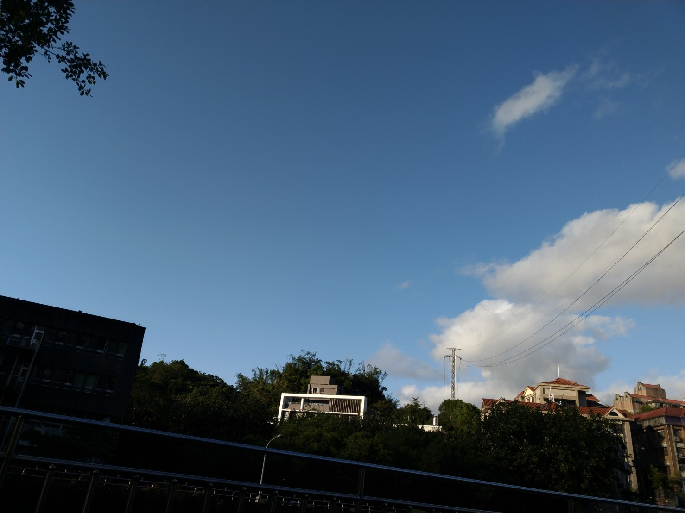
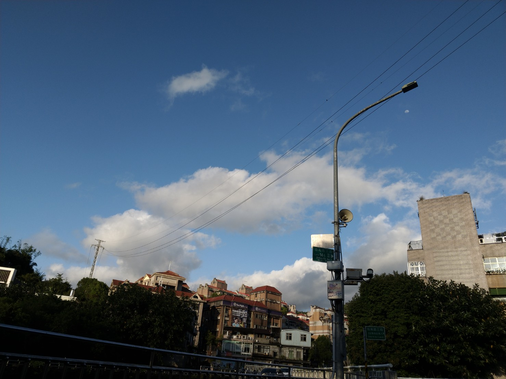
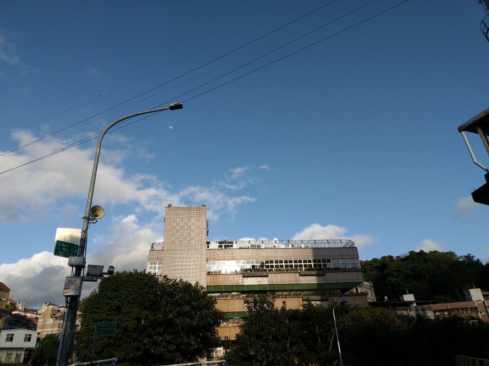

# Computer Vision
2022 fall homeworks 1~4

## Description
### Example: Panorama
Input:  
  
Output:  
  
HW1: Scale Invariant Feature Detection and Image Filtering  
HW2: Scene Recognition & Image Classification Using CNN  
HW3: Projective Geometry  
HW4: Stereo Matching  

